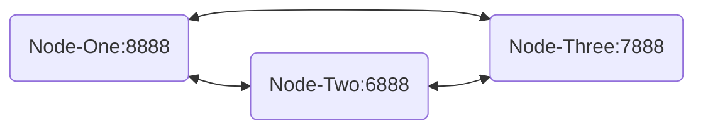

# Readme

## Purpose  
The TLDR; Quickly set up Antelope Software and see Savanna working with near instant finality.
See [Use Cases](doc/use-cases-private-network.md) for background.

## Topology

This reference and documentation sets up three separate nodes on a single host. Each node is a separate process distinguished with different port numbers.

## Quick Start Guide

- Build Docker Image
   - `./bin/docker-build-image.sh`
- Start Docker Container with Image
   - `./bin/docker-create-container.sh`
- Enter the Container
   - `./bin/docker-enter-container.sh`
- Setup Antelope Network, run from inside the docker container
   - `/local/eosnetworkfoundation/repos/bootstrap-private-network/bin/finality_test_network.sh CREATE`
- See `last_irreversible_block_num` is many blocks behind `head_block_num`

   - run `cleos get info` from inside the docker container

The `last irreversible block` has been agreed to by the network, and can not be changed. This represents the last step in finalizing work across all the nodes. The head block has committed transactions that may be changed in the event of a bad actor, and error, or other synchronization issue.

- Activate Savanna, run from inside the docker container
   - `/local/eosnetworkfoundation/repos/bootstrap-private-network/bin/finality_test_network.sh SAVANNA`
- See Last Irreversible Block is *-->three<--* block behind Head Block

   - run `cleos get info` from inside the docker container

The new algorithm is finalizing blocks faster. Even as producers scale up the SAVANNA algorithm will maintain the same 3 block delta between the `last_irreversible_block_num` and the `head_block_num`.

## Step By Step Documentation
See [Step By Step](doc/step-by-step.md)

Changes for larger [multi-host production systems](doc/large-scale-setup.md)

## Versions of this Repo
Listing of [Versions](doc/change-list.md) between releases of this bootstrap repo across Antelope software. See [Latest Change Log](changes/May232024.md) for PRs between releases.

## Frequently Asked Questions
Q: Why is nodeos version `v1.0.1`?
A: The version was reset to `v1` with the new launch of Spring.

Q: How do I free up more disk space?
A: Docker can chew up a lot of space try the following commands
- `docker volume prune -f`
- `docker system prune -a -f`

Q: How do I remove the old docker image
A: Look for the docker image id and remove it.
- `docker image ls | grep savanna-antelope`
- `docker image rm a1a1aa111a11`

Q: How do I stop and remove the old docker container.
A: The following commands should do it
- `docker container stop savanna-private-net`
- `docker container rm savanna-private-net`
